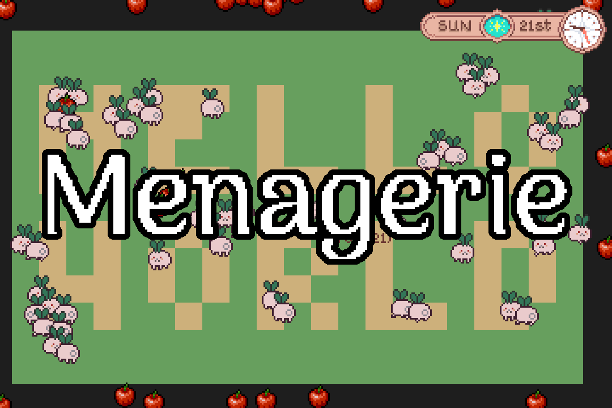

A game-in-progress about gardening virtual agents. Now with a [devlog](https://sandbird.itch.io/menagerie)!

I've been plucking away at this on and off for a long time, and will probably be at it for just as long again before it's actually something playable.  That's okay, though - this codebase is my own garden.  In that spirit, my current vision for the game takes some inspiration from the development process itself: sort of a sandbox where creating your own content (monsters, items, etc) is part of the experience.  To that end, a modular content system is a big part of Menagerie's design.

Influences and references:
- The Sims
- Viva Piñata
- Sonic Adventure 2's Chao Garden
- Steve Grand's development notes on Creatures (I never actually played the game, but I sure read about it)
- Harvest Moon / Stardew Valley
- Animal Crossing (especially New Leaf)
- Pokemon (especially Scarlet)
- Wobbledogs
- https://orb.farm
- Tamagotchi
- Neopets

# Overview 

Some general documentation on the game's systems. Also see the [docs](docs) directory.

## File structure

Scenes and scripts are grouped by domain - `garden`, `entity`, `ui`, etc.  The [`system`](game/system) folder contains the base scene [`game.tscn`](game/system/game.tscn) and global scripts.  The [`assets`](game/assets) folder contains all resources for the game itself (ui panel textures, fonts, etc).

Menagerie makes a sharp distinction between code and content: monsters, items, objects, npcs, locations, etc.  The latter live in [`data`](game/data) and are defined in JSON files so as to be modular and extensible.  On init, the Data global ([`system/data.gd`](game/system/data.gd)) loads, parses, and validates these, using [`system/validator.gd`](game/system/validator.gd) and the JSON-schema files in [`data/system`](game/data/system/).

Within the [`data`](game/data) folder, data definitions are organized into folders by type.  This is just for convenience, and is not required by the data loader.

## Monster AI

Menagerie uses a Sims-like needs-based system where interactibles in a monster's environment "advertise" potential actions and the effects they will have on the monster's drives (energy, belly, mood, and social).  This is documented in more detail in [`monster/decider.gd`](game/entity/monster/decider.gd), which is (currently) a static global class whose functions take the monster as an argument.  In essence:

1. When a monster has no action, it asks the decider to choose one for it.
2. First the decider polls sources: this should ask the garden for all interactibles within range of the monster, then instantiate all their possible actions with whatever parameters they require (always monster, typically target, and sometimes duration).
3. Actions themselves determine the likely impact to a monster's drives if it performs the action via the `estimate_result` and `mod_utility` functions.  The decider calls these for each action, then compares all the estimated results in `calc_utility`.  The final formula should be complex and depend on both randomness (monsters should not always pick the most optimal action) and the monster's attributes.
4. Finally, the monster takes the action returned by the decider and sets it as its current action.  The action is executed in two ways: on each frame (`_physics_process`) the monster calls the action's `proc` function, and on each game tick it calls the action's `tick` function.  The latter returns a set of changes to the monster's drives, which are updated each tick.

Actions work similarly to behavior trees, though they aren't defined in as strict of terms.  Instead of composites of "leaf" actions (go here, eat this), they should have optional prerequisites: the "eat" action (which requires an edible item as a target) should queue an "approach" action with the food as its target if the monster is too far away.

## Dispatcher

The global signal handler is called Dispatcher and lives in [`system/dispatcher.gd`](game/system/dispatcher.gd).  All the signals are defined in there, so it functions as handy library of them.  Trigger with `Dispatcher.signal.emit(args)`, or `Dispatcher.emit_signal('signal', args)` if the signal name is being computed dynamically.

## UI stack

Manipulate the UI stack with the dispatcher signals `ui_open`, `ui_close`, and `ui_toggle`.  There's also `menu_open` for opening the main "book" menu to a specific page.

`ui_open` adds the element (first parameter) to the top of the stack by default, but it can also insert the element at a specific index of the stack (second parameter), removing anything that would have been above it.  The UI stack will save these elements and restore them when the element is removed, unless `false` is passed as the third parameter (default is true).  Also see the `open` function in `ui/ui.gd`.

When an element is removed from the UI stack, it's freed from memory.

## Main menu

The [main menu](game/ui/main_menu/main_menu.gd) is themed like a book and is thus organized into "chapters" and "sections".  All menu navigation should be done through the `menu_open` signal, which accepts either a chapter key or a `[chapter, section]` path array to open a specific section. It can also be called without a path -- that is, with `null` or `[]`, since signals don't support optional arguments -- to open the menu to the last page or a default page.

Each [menu chapter](game/ui/main_menu/menu_chapter.gd) has a `sections` dict which maps section keys to the NodePath of a PackedScene for that section, and implements a `build_index` function which populates this dict -- eg, the `monsters` chapter has a [monster details](game/ui/main_menu/monsters/monster_details.gd) section for each monster in the garden, keyed by the monster's uuid.  Currently, the main menu initializes all of its chapters (calling all their `build_index` functions) whenever it's opened.

Menu chapters and sections maintain relative positioning; when navigating between chapters or sections, we play a page-turn animation in the direction of the new page relative to the old one.  This works because Godot dicts maintain element ordering.

## Dev console

Open the console in-game with `` Alt + ` ``.

Note that tokenization is fairly dumb and only splits on spaces, meaning arguments cannot have spaces in them even within quotes.  Also note that not all commands are documented in `help`; see [`console.gd`](game/ui/console/console.gd) for the full list.

## Game clock

While in the garden, time passes according to the game clock defined in `system/clock.gd`.  The basic unit is the tick (~0.5 seconds); this is when entities update state and perform behaviors that don't rely on the physics process (ie everything but moving around).

A tick is something like a twelfth of an in-game "hour"; `clock.gd` defines all the other units that make up the game's calendar, and keeps track of in-game time.  Every time one of these units rolls over, it dispatches a corresponding event, eg `date_changed`, which implies that `hour_changed` and `tick_changed` were also just fired).  Most entities connect to the tick event, but the garden UI connects to some of the others to update the displayed date, and somewhere we have code that saves the game every time the in-game date rolls over.

## Viewport scaling

Menagerie is rendered to a low-resolution [viewport](game/system/viewport.gd) which is then integer-upscaled to fill as much of the window as possible.  The viewport resolution is dynamic within certain constraints (maximum and minimum width, height, and aspect ratio).  Based on the window size, the viewport chooses an appropriate scale factor and base resolution.  The scaled viewport is then rendered in the center of the window, so that it will appear letterboxed if it doesn't fit perfectly into the window's resolution.
